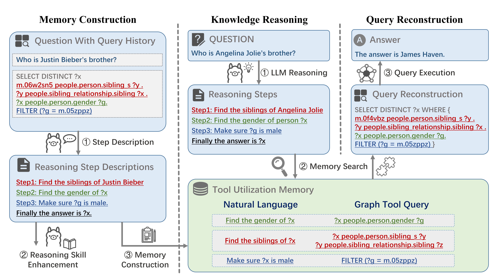
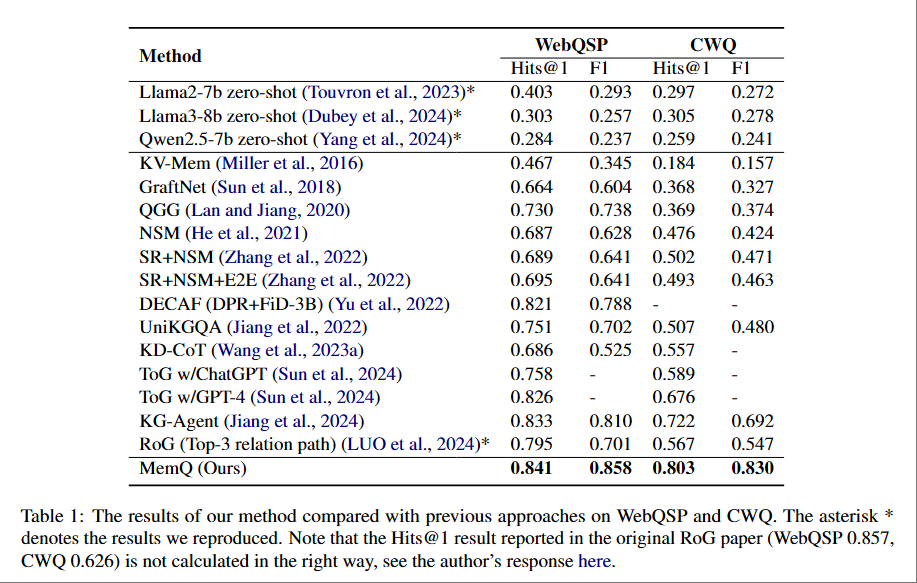
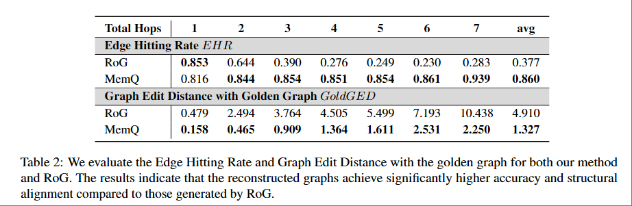
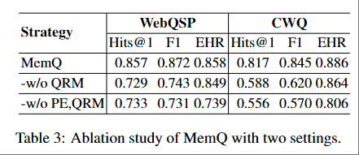
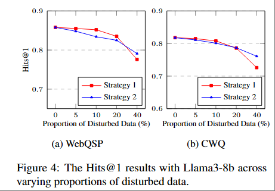

# MemQ

Official Implementation of ACL 2025 paper: "[Memory-augmented Query Reconstruction for LLM-based Knowledge Graph Reasoning](https://arxiv.org/abs/2503.05193)"



Memory-augmented Query Reconstruction (MemQ) is a novel framework designed to enhance LLM-based knowledge graph reasoning. By introducing the Memory module, MemQ decouples the LLM's knowledge reasoning process from tool invocation.  

During training, MemQ first constructs a memory through rule-based decomposition of the SPARQL queries and their descriptions generated by a general-purpose LLM. With the memory, the framework proceeds to fine-tune an open-source LLM for generating human-readable reasoning steps. During inference, the fine-tuned LLM first generates reasoning steps which are subsequently utilized by the Query Reconstruction Module to retrieve contextually relevant memories and assemble the final executable query.

MemQ achieves state-of-the-art results on benchmarks like WebQSP and CWQ, demonstrating its effectiveness in solving the knowledge graph reasoning task. The framework generates interpretable reasoning paths to improve readability while significantly mitigating hallucination from tool interactions.

## Requirements
```
pip install -r requirements.txt
```

## Step1: Preparation

### Download Datasets

- **WebQSP**: Download the WebQSP dataset from [here](https://www.microsoft.com/en-us/research/publication/the-value-of-semantic-parse-labeling-for-knowledge-base-question-answering-2/).

- **CWQ**: Download the CWQ dataset from [here](https://www.dropbox.com/sh/7pkwkrfnwqhsnpo/AACuu4v3YNkhirzBOeeaHYala)

### Setup Freebase KG Service
Follow the [Freebase Virtuoso Setup](https://github.com/dki-lab/Freebase-Setup) to setup Freebase Virtuoso DB.

## Step2: Data Process

### 2.1 preprocess

`python get_my_traindata.py` -> my_webqsp_train.json

### 2.2 build graph

`python build_graph_train.py` -> webqsp_train_graph.json

### 2.3 get CVT

make sure you start the freebase KG service first

`python get_cvt_list.py` -> webqsp_train_cvt_list.json

### 2.4 split graph

`python graph_split.py` -> all_key.json, merge_split_data.json

### 2.5 explain keys to build memory

make sure you fill in the api key in get_key_explain.py

`python get_key_explain.py` -> explain_keys.json

### 2.6 generate query explanation  

`python graph_explain.py` -> merge_explain_data.json

## Step3: Train

### 3.1 get finetune data

`python gen_memq_finetune_data.py` -> output/memq_finetune_data.json

### 3.2 follow the llamafactory

Follow the [llamafactory](https://github.com/hiyouga/LLaMA-Factory), use the data above to finetune the model with lora rank=16, epoch=5.0

## Step4: Inference

You can find the pre-trained weights [here](https://pan.baidu.com/s/1wPX9iz67m5SB4BAnIiSTMw?pwd=memq).

### 4.1 preprocess the test data

`python get_my_testdata.py` -> my_webqsp_test.json

`python build_graph_test.py` -> webqsp_test_graph.json

### 4.2 generate prompt

`python gen_prompt_test.py` -> webqsp_test_prompt.json

### 4.3 generate test plan

`python gen_testplan.py` -> webqsp_test_plan.json

## Step5: Reconstruct SPARQL Query and Evaluate

`python reconstruct.py` -> webqsp_test_reconstruct.json

## Results

### Main Result


### Reasoning Capability Enhancement


### Ablation Study


### Robustness



<!-- ## Bibinfo
If you found this repo helpful, please help us by citing this paper:
```
@inproceedings{luo2024rog,
title={Reasoning on Graphs: Faithful and Interpretable Large Language Model Reasoning},
author={Luo, Linhao and Li, Yuan-Fang and Haffari, Gholamreza and Pan, Shirui},
booktitle={International Conference on Learning Representations},
  year={2024}
}
``` -->
